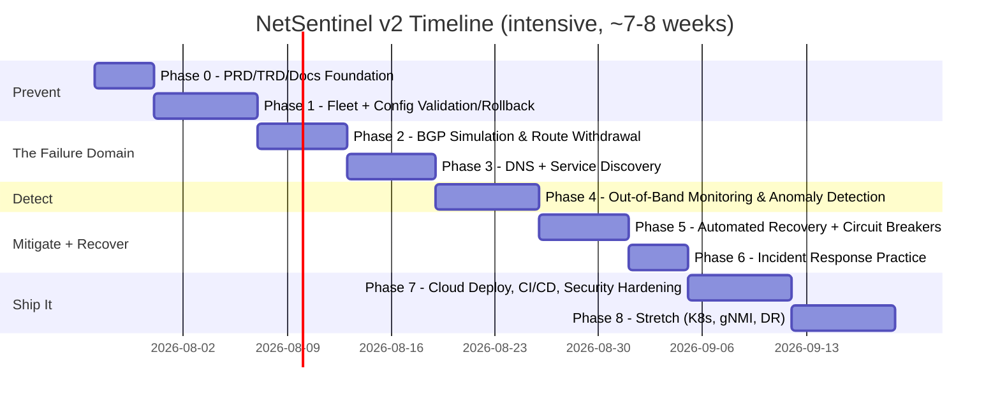

# Maestro — A Resilient Infrastructure Platform, Inspired by the October 4, 2021 Meta Outage

Author: Hugo | Origin: Meta RNE Hackathon (Honorable Mention) | Full deliverable set in `/docs`

---

## 0. The Real Incident, in One Paragraph (Your Design Brief)

A routine maintenance command intended to assess backbone network capacity instead disconnected all of Meta's backbone connections globally. Meta's DNS servers are designed to **withdraw their own BGP route announcements** if they can't reach the data centers — a safety mechanism that, in this case, triggered simultaneously across the fleet because the backbone itself was down. The result: Meta's authoritative DNS servers became unreachable worldwide. Everything that depended on DNS to find anything else — including the internal tools engineers needed to diagnose and fix the problem, and even physical badge readers — broke at the same time. The outage lasted as long as it did partly because the tools to fix it were themselves victims of it.

This is the design brief for the whole project. Four causally linked failure modes, one demonstrated end-to-end:

**Bad config → backbone/BGP failure → DNS unreachable → service discovery breaks → cascading failure across dependent services → monitoring struggles because it shares fate with the thing it monitors → recovery is slow because the fix-it tools are also down.**

You will build a small, real version of this entire chain — trigger it on purpose, watch it cascade, and build the systems that would have shortened it from 6 hours to 6 minutes.

---

## 1. Scope Decision (read this before building)

Covering every listed challenge (BGP, DNS, service discovery, cascading failure, load balancing, zero-trust, DR, capacity planning, monitoring, incident response) at full depth is a 4-6 month effort. To keep this at 1-2 months intensive, scope is deliberately split:

| Tier | Systems | Why |
|---|---|---|
| **Deep build (real, hands-on)** | Config validation/rollback, BGP simulation, DNS + service discovery, out-of-band monitoring, automated recovery/runbooks, incident response practice (real tabletop exercises against your own system) | This is the actual causal chain from the real outage — detect, prevent, mitigate, recover, in that order. Building these deep tells one coherent, defensible story. |
| **Documented + partially simulated** | Load balancing, disaster recovery / multi-region failover, capacity planning | You design and document these properly (own docs, own diagrams) and implement a minimal/simplified version, but they aren't the deep-dive. Honest in interviews: "designed and partially implemented, prioritized against timeline." |
| **Stretch (Phase 8+, only if ahead of schedule)** | Full zero-trust IAM (SPIFFE/mTLS everywhere), Kubernetes migration, gNMI streaming telemetry, multi-region active-active | Real, valuable, but not required to tell the core story. |

This tiering is itself a **prioritization decision** — document it as one in your PRD (see `docs/01_PRD.md`). Being able to say "I scoped this deliberately, here's the framework I used" is a stronger interview answer than pretending everything was built equally deep.

---

## 2. What "Detect, Prevent, Mitigate, Recover" Means Here

| Phase of the incident | What you build | Real-world equivalent |
|---|---|---|
| **Prevent** | Config schema validation, staged rollout, automatic rollback on health-check failure | The exact safeguard missing in the real incident — the change that broke everything was never validated against a canary before going fleet-wide |
| **Detect** | Out-of-band monitoring (a path that does *not* depend on your primary DNS/network), BGP session + route-table watchers, anomaly detection | Meta's own monitoring was degraded because it depended on the same DNS/network it was watching — the single most important lesson from the postmortem |
| **Mitigate** | Automated runbooks (self-healing for known failure signatures), circuit breakers and DNS fallback caching in your services, human-in-the-loop escalation for anything touching routing | Reduces blast radius and buys time even before a human is paged |
| **Recover** | Incident response playbooks, out-of-band access path (a "break-glass" way to reach your systems even if the primary network is down), postmortem process | This is exactly what made the real incident last ~6 hours instead of ~20 minutes — engineers reportedly had trouble physically accessing the datacenters because badge systems also depended on the broken network |

---

## 3. Phased Roadmap (6-8 weeks, cut-scope version)

### Phase 0 — Documentation Foundation (Days 1-4)
Write PRD, TRD, and Business Analysis *before* code (see `/docs`). Define personas, KPIs (MTTD, MTTR, blast-radius reduction %), and the prioritization framework you'll defend all project.
**Artifact:** `docs/01_PRD.md`, `02_TRD.md`, `03_BUSINESS_ANALYSIS.md`

### Phase 1 — Simulated Fleet + Config Prevention (Week 1)
Containerlab + FRRouting topology (3 routers, leaf-spine). Config system: JSON-Schema-validated YAML → Jinja2 → Netmiko push, with staged rollout (canary device first) and automatic rollback if a post-push health check fails.
**Learning:** Docker, IaC principles, templating, idempotency, CI validation gates.
**Artifact:** `netsentinel-fleet` repo, GitHub Actions badge, a recorded PR where a bad config gets caught before it ships.

### Phase 2 — BGP Simulation & Route Withdrawal (Week 2)
Configure real eBGP sessions between your FRR routers. Build a script that mimics Meta's actual DNS-server pattern: a service self-withdraws its BGP route announcement when it can't reach a health-check target. Trigger it deliberately and watch routes disappear from the routing table in real time.
**Learning:** BGP fundamentals, routing tables, route propagation, failure-mode design.
**Artifact:** `docs/05_NETWORK_ARCHITECTURE.md` diagrams + a terminal recording of a live route withdrawal.

### Phase 3 — DNS + Service Discovery (Week 3)
Run your own DNS layer (CoreDNS or BIND) backed by the service registry your FastAPI backend maintains. Make your microservices resolve each other via DNS (not hardcoded IPs) — this is what makes "DNS goes down" an actual cascading failure in your system, not just a talking point.
**Learning:** DNS internals, service discovery patterns, distributed systems dependency management.
**Artifact:** `docs/06_DATABASE_DESIGN.md`, `07_API_SPECIFICATION.md`, a demo GIF of services failing to find each other when DNS is killed.

### Phase 4 — Out-of-Band Monitoring & Detection (Week 4)
Build a monitoring path that survives the failure you just created in Phase 2-3: a secondary, independent route to your metrics/alerting (different network path, cached last-known-good state, local health agents that don't need DNS to report). Add statistical + ML anomaly detection on top.
**Learning:** observability architecture, failure-domain isolation, anomaly detection (scikit-learn), Prometheus/Grafana at depth.
**Artifact:** `docs/12_MONITORING_OBSERVABILITY.md`, dashboard showing the cascade in Phase 2-3 as it happens, with the out-of-band path staying green.

### Phase 5 — Automated Recovery + Resilience Patterns (Week 5)
Runbook engine for known failure signatures (auto re-announce a withdrawn route once health checks pass again). Circuit breakers and DNS-failure fallback caching in your services (stale-but-available beats fully down). Human-in-the-loop gate for anything that touches routing.
**Learning:** self-healing systems, circuit breaker pattern, event-driven automation, LLM-assisted RCA (Claude API summarizing what happened and why).
**Artifact:** `docs/13_AI_INTEGRATION.md`, example auto-generated RCA report from a real triggered incident.

### Phase 6 — Incident Response Practice (Week 6, short)
Run your own "game day": trigger the full chain against your own system, time yourself against your defined SLAs, write a real postmortem using your own template.
**Learning:** incident management, severity classification, blameless postmortems — genuine SRE practice, not just reading about it.
**Artifact:** `docs/16_INCIDENT_RESPONSE_PLAYBOOKS.md` + one real postmortem document from your own game day.

### Phase 7 — Cloud Deployment, CI/CD, Security Hardening (Week 7)
Oracle Cloud Always-Free VM, Docker Compose → k3s, GitHub Actions CI/CD with Trivy/pip-audit scanning, Cloudflare Tunnel for HTTPS, RBAC on the API, secrets hygiene. Includes a documented **break-glass access path** — a way to reach your system if its normal network path is down, directly answering the "engineers couldn't get in" part of the real incident.
**Artifact:** `docs/09_SECURITY_ARCHITECTURE.md`, `10_INFRASTRUCTURE_ARCHITECTURE.md`, `11_CICD_DESIGN.md`, live deployed URL.

### Phase 8 — Stretch (if ahead of schedule)
Kubernetes/Helm migration, gNMI streaming telemetry (what Meta itself actually uses for DC telemetry), a documented (not necessarily deployed) multi-region DR design, load-balancer implementation (HAProxy/Envoy).

---

## 4. Full Deliverable Set

All 18 documents live in `/docs`. Start with `docs/00_INDEX.md` — it has the full role/skill/outage-challenge mapping matrix.

| # | Document | Core question it answers |
|---|---|---|
| 00 | INDEX + Role/Skill Matrix | What does each component teach, and who is it for? |
| 01 | PRD | What are we building and for whom? |
| 02 | TRD | How, technically, and under what constraints? |
| 03 | Business Analysis | Why does this matter, what's the cost of getting it wrong? |
| 04 | System Architecture | How do the pieces fit together? |
| 05 | Network Architecture | What does the actual topology and routing look like? |
| 06 | Database Design | How is state modeled and stored? |
| 07 | API Specification | What are the service contracts? |
| 08 | UI/UX Strategy | How do humans interact with this under stress? |
| 09 | Security Architecture | What's the threat model and how is it mitigated? |
| 10 | Infrastructure Architecture | What runs where, and how is it provisioned? |
| 11 | CI/CD Design | How does code safely become running infrastructure? |
| 12 | Monitoring & Observability Strategy | How do we see what's happening, even when things break? |
| 13 | AI Integration | Where does AI genuinely help vs. add noise? |
| 14 | Testing Strategy | How do we know it works, including under failure? |
| 15 | Deployment Strategy | How do changes go live safely? |
| 16 | Incident Response Playbooks | What do we do at 2am when it breaks? |
| 17 | Portfolio Documentation | How do I present this to recruiters/interviewers? |

*Product-management practice (PRD authorship, personas, RICE/MoSCoW prioritization, KPI tracking, roadmapping, stakeholder updates) is woven through every phase, not confined to Phase 0 — see `docs/01_PRD.md` §7 for the cadence.*
