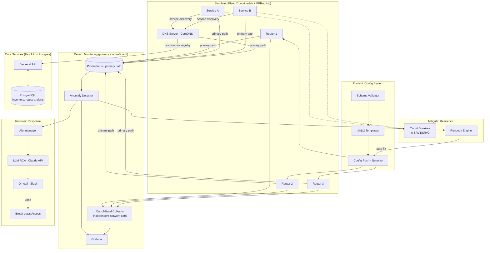
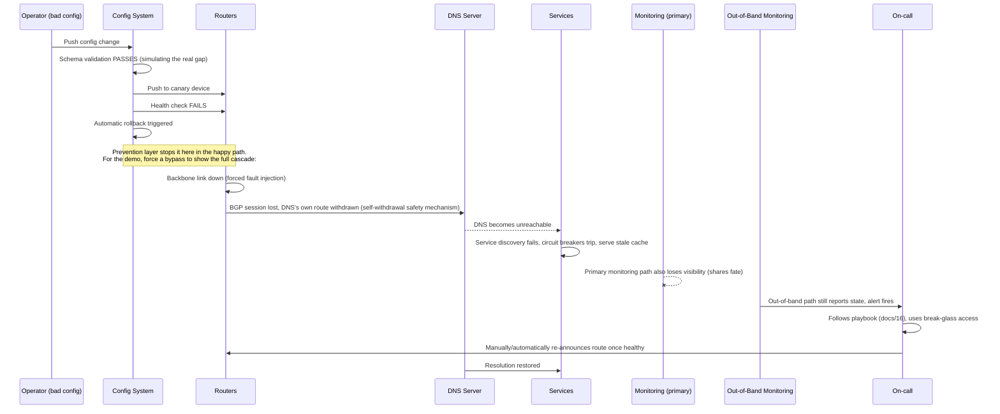

# System Architecture — Maestro

## 1. Component Overview

## 2. Component Responsibilities

| Component | Responsibility | Failure mode it must survive |
|---|---|---|
| Fleet (Containerlab/FRR) | Simulated network substrate | N/A — this is the thing that fails |
| Config System | Validate + safely push device config | Must catch bad config before fleet-wide push |
| Primary Prometheus | Standard metrics collection | Expected to degrade/fail when network fails — this is intentional |
| Out-of-Band Collector | Independent telemetry path | Must stay up when primary path is down |
| Anomaly Detector | Statistical/ML detection on top of metrics | Must not depend on primary path alone |
| Runbook Engine | Automated remediation for known signatures | Must be conservative — no action outside its known-safe set |
| Circuit Breakers (in services) | Graceful degradation when a dependency is unreachable | Must not cascade a DNS failure into a full service crash |
| Alertmanager + LLM RCA | Routing + explaining alerts | Must reach on-call via a path independent of the failure |
| Break-glass Access | Human access path during total network failure | Must not depend on the primary network at all |
| Backend API + Postgres | Source of truth for inventory/registry/alerts | Standard HA/backup practices (see `10_INFRASTRUCTURE_ARCHITECTURE.md`) |

## 3. Failure-Chain Walkthrough (the scenario this system is built to survive)

This diagram is the single most important artifact in the whole project — it's the thing to walk through in an interview or presentation.

## 4. Design Principles

1. **No component's monitoring shares a failure domain with the component itself** (the core lesson of the real incident).
2. **Prevention is cheaper than detection; detection is cheaper than recovery** — effort is weighted accordingly (see roadmap tiering).
3. **Automate the boring 80%, gate the risky 20% behind a human** (runbook engine tiering).
4. **Every action is logged with actor and timestamp** — auto or human, for postmortem accuracy.
