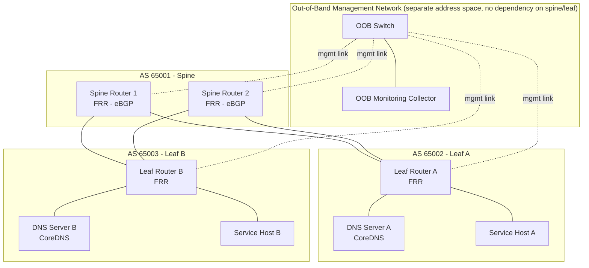

# Network Architecture — Maestro

## 1. Topology

Leaf-spine is the standard data-center topology (used at real hyperscalers, including Meta) because it gives predictable, equal-cost paths between any two leaves and scales horizontally by adding spines. The **out-of-band (OOB) management network** is architecturally separate — different address space, different physical/virtual path — specifically so that a failure in the production spine/leaf fabric cannot also take down the ability to observe or reach it. This is the direct engineering answer to the real incident's monitoring/access blind spot.

## 2. BGP Design

- Each leaf and spine runs FRRouting in a separate AS, peering via eBGP (mirrors real DC fabric design, where iBGP/eBGP or pure eBGP-everywhere designs are both used — this project uses eBGP-everywhere for pedagogical clarity: every route change is a visible AS-path change).
- **Self-withdrawal pattern:** DNS servers (and, in Phase 8 stretch, other critical services) run a health-check sidecar that withdraws the service's own route announcement if it cannot reach its backbone/spine within N failed health checks. This exactly reproduces the mechanism Meta's own postmortem describes as the proximate cause of the DNS outage — a safety mechanism that, when triggered simultaneously fleet-wide by a common-cause failure (the backbone itself), removes the thing it was meant to protect from the network entirely.
- Route withdrawal is observable in real time via `vtysh -c "show bgp summary"` and `show ip route` on any FRR node, and is scraped into Prometheus via a custom BGP exporter for dashboarding.

## 3. DNS Design

- CoreDNS instances at each leaf, authoritative for the internal service domain (e.g., `*.netsentinel.internal`).
- Services register themselves in the Postgres-backed service registry (see `06_DATABASE_DESIGN.md`); a small sync agent keeps CoreDNS zone files (or the `etcd`/`postgres` CoreDNS plugin) consistent with the registry.
- Client-side: services resolve dependencies via DNS, not hardcoded IPs — this is what makes "DNS goes down" a real, observable service-discovery failure in this system rather than a documented-only concept.
- Fallback: services cache the last-successful resolution with a TTL-aware stale-if-error policy, so a DNS outage degrades performance rather than causing a hard crash (see `14_TESTING_STRATEGY.md` for how this is validated).

## 4. Fault Injection Points

| Fault | Mechanism | What it demonstrates |
|---|---|---|
| Backbone link down | `tc netem loss 100%` on the spine-leaf link, or container network disconnect | Root trigger analog |
| BGP session drop | Kill FRR process or block BGP port (TCP 179) | Route withdrawal cascade |
| DNS unreachable | Stop CoreDNS container / block UDP 53 | Service discovery failure |
| High latency (partial degradation) | `tc netem delay 500ms` | Distinguishing "slow" from "down" — a harder, more realistic detection problem |
| Packet loss (partial) | `tc netem loss 20%` | Tests anomaly detection sensitivity vs. false-positive rate |

## 5. Load Balancing (documented, minimal implementation — see roadmap scope tier)

Design: HAProxy or Envoy in front of Service A/B replicas, L7 health-check-aware routing. Minimal implementation target: a single HAProxy instance with active health checks, documented failover behavior, not a full multi-region/anycast design (that's Phase 8 stretch, alongside multi-region DR in `10_INFRASTRUCTURE_ARCHITECTURE.md`).
