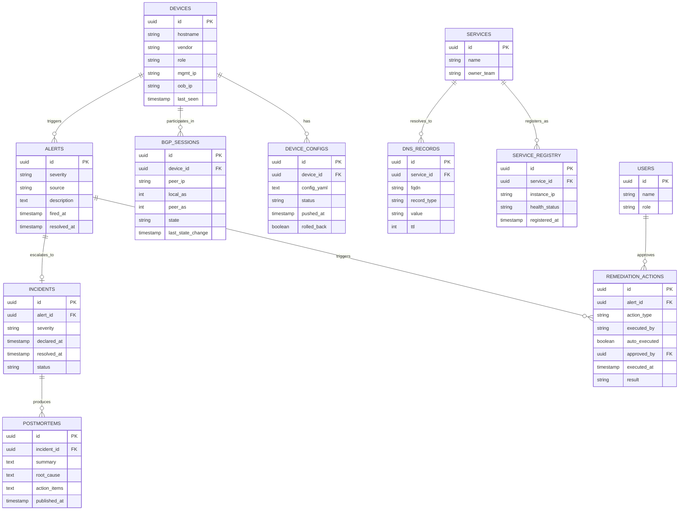

# Database Design — Maestro

PostgreSQL, accessed via SQLAlchemy models with Alembic migrations. No manual schema edits — every change is a migration, mirroring real-team practice.

## 1. Entity-Relationship Diagram

## 2. Design Notes

- **`DEVICE_CONFIGS.rolled_back`** exists specifically to make the Phase 1 rollback mechanism auditable — every push attempt is a row, not just successful ones.
- **`BGP_SESSIONS.state`** (established/idle/active/connect) is polled and stored so route-flap history is queryable after the fact, not just visible live in Grafana.
- **`SERVICE_REGISTRY` is the source of truth DNS syncs from** — this is the concrete implementation of "loss of service discovery" as a data problem, not just a network problem.
- **`REMEDIATION_ACTIONS.auto_executed` + `approved_by`** implements the human-in-the-loop tiering directly in the schema — every action's provenance is queryable.
- **`INCIDENTS` and `POSTMORTEMS`** are deliberately separate from `ALERTS` — not every alert becomes an incident, mirroring real severity-based escalation practice (see `16_INCIDENT_RESPONSE_PLAYBOOKS.md`).

## 3. Indexing & Performance Notes

- Index `alerts.fired_at`, `bgp_sessions.last_state_change`, and `device_configs.pushed_at` — all time-range-queried heavily by dashboards.
- `service_registry.health_status` indexed for the DNS sync agent's polling query.
- At this project's scale, performance tuning is a documentation/design exercise (explain query plans, note where a read replica or caching layer would go at real scale) rather than a load-bearing requirement — noted honestly rather than over-engineered.
