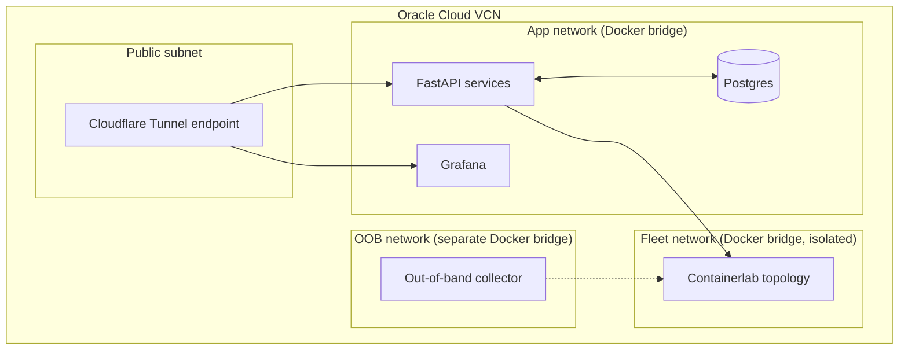

# Infrastructure Architecture — Maestro

## 1. Deployment Target

Single Oracle Cloud **Always-Free** VM (`VM.Standard.A1.Flex`, up to 4 OCPU / 24GB RAM, ARM-based, genuinely free forever, not a 12-month trial). Sized generously enough to run the full stack (Containerlab fleet + Prometheus + Grafana + Postgres + FastAPI services + CoreDNS) as Docker Compose services initially, migrating to a single-node k3s cluster once the stack is stable (Phase 7).

## 2. Infrastructure as Code

- **Provisioning:** Terraform (OCI provider) for the VM, VCN (virtual cloud network), and security-group/firewall rules — even a single VM is provisioned declaratively, not clicked through a console, because that's the actual industry expectation.
- **Configuration/orchestration:** Docker Compose manifests (Phase 1-6) → Helm charts (Phase 8 stretch, once on k3s).
- **Principle:** no manual server changes, ever — every change is a file in the repo, applied via CI/CD (see `11_CICD_DESIGN.md`). This is the same discipline the Config System enforces for the simulated fleet, applied to the real hosting infrastructure too.

## 3. Network Layout (on the VM)

Even on a single VM, the three networks (app, fleet, OOB) are kept as **separate Docker bridge networks** — this is the small-scale analog of real network segmentation, and it's what makes the out-of-band monitoring path a genuine architectural property rather than a labeling exercise.

## 4. Redundancy & Availability (documented scope)

Single-VM deployment is a deliberate, disclosed constraint of the free-tier/solo-dev scope — not presented as production-scale HA. What's implemented vs. documented:

| Concern | Implemented | Documented only (v2 design) |
|---|---|---|
| Service restarts on crash | ✅ Docker restart policies | — |
| Data backup | ✅ Nightly Postgres dump to a second free-tier object storage bucket | — |
| Multi-AZ/region failover | — | RTO/RPO targets and failover design below |
| Load balancing across replicas | Minimal HAProxy in front of 2 service replicas | Full anycast/global LB design |

## 5. Disaster Recovery Design (documented)

- **RTO target (documented):** 15 minutes for a full VM loss, via a scripted Terraform re-provision + latest Postgres backup restore.
- **RPO target (documented):** 24 hours (nightly backup cadence) — acceptable for a portfolio project, explicitly flagged as insufficient for a real production system (which would need continuous replication).
- **Multi-region active-active:** documented as the "if this were real" answer — a second Oracle free-tier region (subject to account limits) hosting a warm standby, with DNS-based failover. Not implemented, to keep scope honest against the timeline.

## 6. Capacity Planning (documented)

The real incident began as a routine capacity-assessment task — understanding why that process exists is part of understanding the incident. Documented approach: track resource utilization (CPU/RAM/disk) on the VM via the monitoring stack itself, define a scale-up trigger (e.g., sustained >70% RAM), and document the manual/scripted response (resize the Oracle VM shape, still within free-tier limits where possible). Not load-tested at production scale — noted as a scope limitation, not hidden.

## 7. Why This Matters for Each Role

Infra/DevOps: IaC discipline and free-tier cloud provisioning transfer directly to AWS/GCP/Azure. Network: subnet/segmentation design. SRE: RTO/RPO framing and capacity-planning triggers are core SRE vocabulary. Security: network segmentation is a security control as much as a reliability one.
