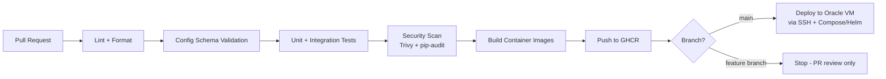

# CI/CD Design — Maestro

## 1. Pipeline Overview

Every gate is a real gate, not decorative: a PR cannot merge to `main` if lint, schema validation, tests, or a critical/high security finding fail. This is the direct, disclosed answer to "how do we prevent another October 4th" — the real incident's root-cause command had no equivalent gate.

## 2. GitHub Actions Workflows

| Workflow | Trigger | Jobs |
|---|---|---|
| `pr-checks.yml` | Pull request opened/updated | lint, schema-validate, unit tests, Trivy/pip-audit scan |
| `build-and-push.yml` | Merge to `main` | build all service images, tag with commit SHA, push to GHCR |
| `deploy.yml` | Successful `build-and-push` on `main` | SSH to Oracle VM, pull new images, `docker compose up -d` (or `helm upgrade` post-Phase-8), run smoke tests |
| `config-push.yml` | Manual dispatch (or approved PR to `config-repo`) | schema-validate → canary push → health check → full push or auto-rollback |
| `nightly-backup.yml` | Cron (daily) | Postgres dump → upload to object storage |

## 3. Environments

| Environment | Purpose | Where |
|---|---|---|
| Local | Development, fast iteration | Developer machine, Docker Compose |
| CI | Automated test execution | GitHub Actions runners |
| Production | The live, demoable system | Oracle Cloud VM |

A dedicated "staging" environment is explicitly out of scope for v1 (documented, not hidden) — at this project's scale, canary rollout within production (Phase 1 config system) serves the same risk-reduction purpose that staging would, and running a second full environment isn't justified against the free-tier budget.

## 4. Deployment Strategy Within CI/CD

- Container images are immutable and tagged by commit SHA — never `:latest` in production, so rollback is always "redeploy the previous SHA," not a manual fix.
- Smoke tests post-deploy hit each service's `/health` endpoint and one representative real endpoint before the deploy is marked successful; failure triggers an automatic redeploy of the previous known-good SHA (see `15_DEPLOYMENT_STRATEGY.md` for the full rollback design).

## 5. Why This Matters for Each Role

SWE/Backend: standard PR-gated workflow every engineering org uses. DevOps/Infra: the pipeline itself is the deliverable — this is what "DevOps" concretely means day-to-day. Security: scan gates are a direct, measurable security control. PM: pipeline health (build success rate, deploy frequency) is a legitimate engineering KPI to track alongside product KPIs.
