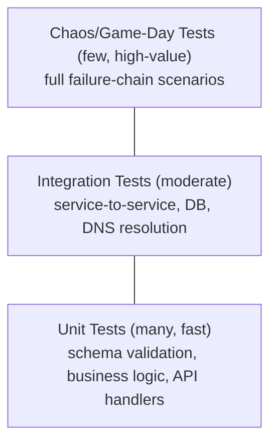

# Testing Strategy — Maestro

## 1. Test Pyramid

## 2. Unit Tests

- Config schema validator: valid configs pass, malformed/malicious configs (e.g., missing required fields, invalid IP ranges, injection attempts in template variables) are rejected — this test suite is arguably the most important one in the project, since it's the direct prevention layer for the real incident's root cause.
- API handlers: standard request/response/auth-boundary tests (`pytest` + FastAPI's `TestClient`).
- Anomaly detector: known normal windows don't fire, known injected-fault windows do fire (using labeled data from the fault-injection tooling itself).

## 3. Integration Tests

- Config push → canary → health check → rollback, run against real (containerized) FRR routers, not mocks — validates the actual mechanism, not just the API contract around it.
- Service registration → DNS sync → resolution, end to end.
- Alert → RCA generation → structured response schema validation (mock the Claude API call in CI to keep tests fast/free; a separate, small "live" smoke test hits the real API before a release).

## 4. Chaos / Game-Day Testing (the highest-value tests in this project)

| Scenario | What's validated |
|---|---|
| Kill the primary network path entirely | Out-of-band monitoring and alerting still function — the core architectural claim of `12_MONITORING_OBSERVABILITY.md`, proven, not just asserted |
| Push a schema-invalid config | Rejected before reaching any device |
| Push a schema-valid but operationally bad config (e.g., wrong AS number) | Canary health check fails, automatic rollback triggers, fleet-wide push never happens |
| Force a BGP self-withdrawal on the DNS host | Full cascade reproduces (route withdrawal → DNS unreachable → service discovery failure → circuit breakers trip) and is fully visible on the Incident View dashboard |
| Trigger 20+ simultaneous alerts | Alertmanager grouping prevents alert-storm/on-call fatigue |

These are run manually during Phase 6 (Incident Response Practice) and, once stable, automated as a scheduled CI job that runs the fault-injection suite against the deployed environment and asserts on MTTD/MTTR — turning "we tested resilience" into a continuously verified, not one-time, claim.

## 5. Contract Testing

Each FastAPI service's OpenAPI schema is checked in CI for breaking changes (new required fields, removed endpoints) before merge — protects the Inventory/Registry/Ops service boundary from accidental coupling.

## 6. What's Explicitly Not Tested at Scale

Production-volume load testing (thousands of devices/requests-per-second) is out of scope and documented as such — this project validates *patterns* under realistic-but-small load, not hyperscale throughput. Noted honestly in this doc rather than implied by omission.

## 7. Why This Matters for Each Role

SWE/Backend: standard test pyramid discipline. SRE: chaos engineering / game-day testing is core SRE practice, rarely taught hands-on before industry experience. Security: config-validator fuzz-style tests double as a security control test. DevOps: automated chaos tests running in CI is a genuinely advanced practice most new grads have never touched.
